# Что такое BOM в JS? 
## Объектная модель браузера (Browser Object Model, BOM) – это дополнительные объекты, предоставляемые браузером (окружением), чтобы работать со всем, кроме документа.
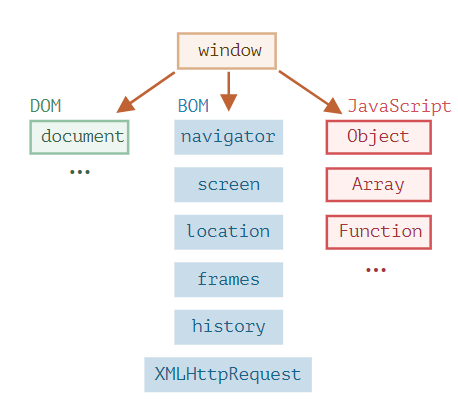
# Например:

+ Объект navigator даёт информацию о самом браузере и операционной системе. Среди множества его свойств самыми известными являются: navigator.userAgent – информация о текущем браузере, и navigator.platform – информация о платформе (может помочь в понимании того, в какой ОС открыт браузер – Windows/Linux/Mac и так далее).
+ Объект location позволяет получить текущий URL и перенаправить браузер по новому адресу.
## Вот как мы можем использовать объект location:
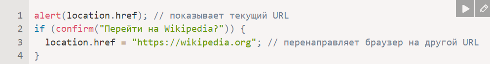
## Функции alert/confirm/prompt тоже являются частью BOM: они не относятся непосредственно к странице, но представляют собой методы объекта окна браузера для коммуникации с пользователем.
# Что такое DOM в JS? 
# В соответствии с объектной моделью документа («Document Object Model», коротко DOM), каждый HTML-тег является объектом. Вложенные теги являются «детьми» родительского элемента. Текст, который находится внутри тега, также является объектом.

# Все эти объекты доступны при помощи JavaScript, мы можем использовать их для изменения страницы.

## Например, document.body – объект для тега <body>.

## Если запустить этот код, то <body> станет красным на 3 секунды:
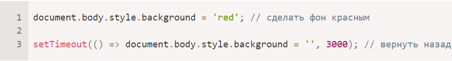
# DOM – это представление HTML-документа в виде дерева тегов. Вот как оно выглядит:
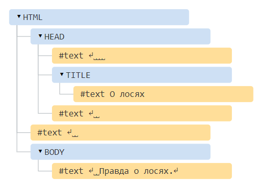
# Особенности DOM
+ ###  JavaScript может изменять все элементы HTML на странице
+ ### JavaScript может изменять все атрибуты HTML на странице
+ ### JavaScript может изменить все стили CSS на странице
+ ### JavaScript может удалять существующие элементы и атрибуты HTML
+ ### JavaScript может добавлять новые HTML-элементы и атрибуты
+ ### JavaScript может реагировать на все существующие HTML-события на странице
+ ### JavaScript может создавать новые HTML-события на странице
# Inner HTML
## Свойство innerHTMLзадает или возвращает HTML-содержимое (внутренний HTML) элемента.
# Пример
### Получить HTML-содержимое элемента с id="myP":
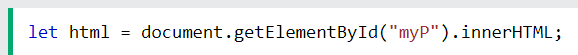
### Измените HTML-содержимое элемента с id="demo":
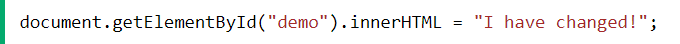
### Получить HTML-содержимое элемента <ul> с id="myList":
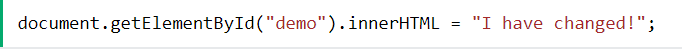
### Удалить HTML-содержимое элемента 
 с id="demo":
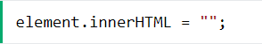
# Style 
## Свойство style возвращает значения атрибута стиля элемента.

## Свойство style возвращает CSSStyleDeclarationобъект.

## Объект CSSStyleDeclarationсодержит все встроенные свойства стилей для элемента. Он не содержит никаких свойств стилей, установленных в разделе <head> или в каких-либо внешних таблицах стилей.
# Пример
## Измените цвет «myH1»:

# События HTML DOM

## События DOM позволяют JavaScript добавлять прослушиватели событий или обработчики событий к элементам HTML.
# Пример
## В HTML onclick — это прослушиватель событий, myFunction — обработчик событий:

# метод createElement()
## В HTML- документе document.createElement()метод создает HTML-элемент, указанный tagName , или элемент, HTMLUnknownElementесли tagName не распознан.
# Пример
## Это создает новый элемент 
и вставляет его перед элементом с идентификатором " div1".
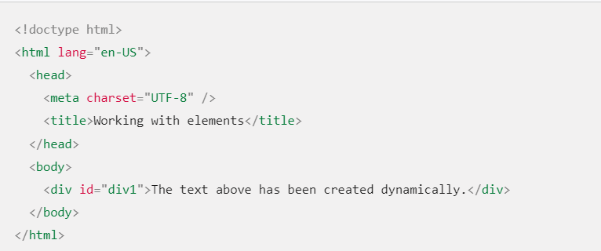
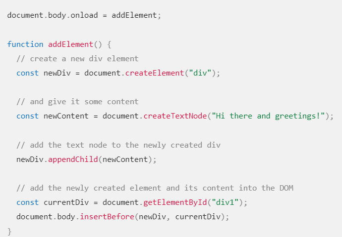
# Результат
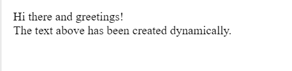

